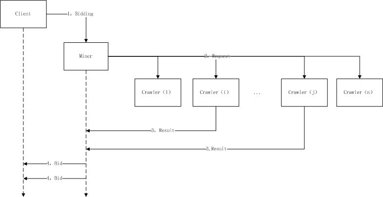
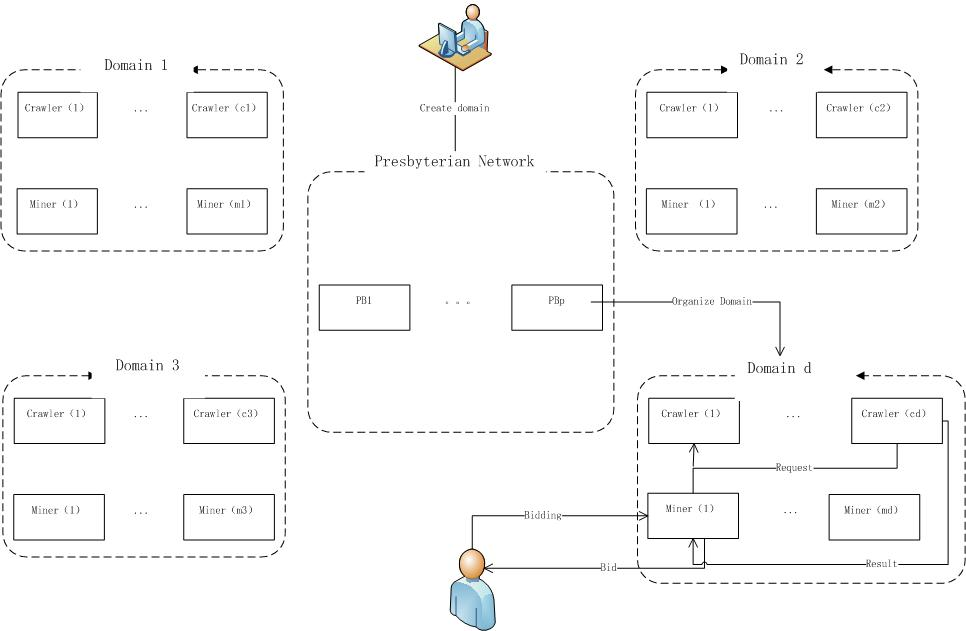
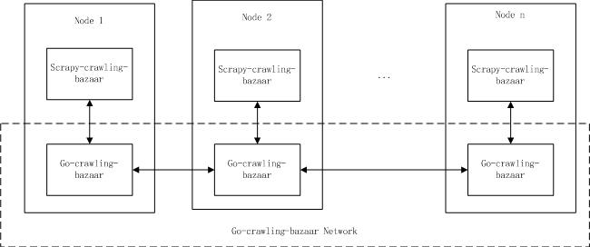

go-crawling-bazaar是一个基于golang实现的去中心化爬虫平台.

## 去中心化爬虫系统
在大数据时代，对于大规模、分布式爬虫的需求日益增加，这要求爬虫设计者要么投入大量设备进行爬取工作，要么购买昂贵的云主机进行爬取，或者将爬取工作外包给拥有大量设备的爬虫服务提供商，但是这些方法使用需要投入大量的金钱或者资源，有没有一种更加廉价的网页数据获取方式呢？受到P2P和去中心化的区块链的启发，我们设计了一个去中心化的爬虫网络。这个网络是由大量的第三方的爬虫节点构成，这些爬虫节点收到来自爬虫客户端的请求后，就会根据一定的算法随机选出少量节点对目标URL进行爬取，爬取结果经过验证后，将存入区块链中，爬虫客户端支付一小笔爬取费用给爬取节点就可以得到页面内容。

## 设计思路
和由大量可信节点构成的中心化爬虫系统（比如scrapy-redis）不同，在我们设计的系统中，任何人都可以搭建爬虫节点并加入爬虫网络，因此，我们面对的是大量不可信节点，如何让若干不可信节点去可信地完成爬取任务，是需要面对并加以解决的问题。
为此，在2019~2020年我们开发了go-decentralized-frontera，在这个项目中，我们使用区块链的智能合约来记录爬取过程中的请求、回应，并记录各种中间状态，这使得爬虫系统费用高，性能差，性价比很低，没法在实际环境中使用.

为了改进这点，我们进行了重新设计，并开发了go-crawling-bazaar这个项目，在这个项目中区块链仅仅用来保存爬取结果，爬取过程则由链上转移到链下，对于一个特定的URL仅由的少量节点负责进行爬取。在这里，我们遇到的挑战是如何确保少量不可信节点可信地完成爬取工作？
我们使用的最主要的验证机制的原理是，如果若干随机挑选的爬虫节点的爬取结果是一致的（或者仅仅有微小的差别），则认为该爬取结果是可靠的。图1给出了Client和系统交互的过程，Client随机地（或者根据一定的指标）找到愿意替他进行爬取工作的Miner节点，并向它提出一个爬取任务（bidding），随后Miner节点将负责控制改爬取任务，并不断广播URL爬取请求（Request），接收到Request的Crawler节点将检查自己是否是本次请求的合格的爬取者，只有那些合格的Crawler节点会进行实际的爬取工作，并将爬取结果保存在DHT存储网络中，并将Result（页面内容的Cid）返回给Miner节点。Miner节点将检查来自若干Crawler返回的结果，如果这些结果能够互相印证，则将URL、Cid以及实际进行爬取工作的Crawler的ID记录到区块链上，当整个爬取任务完成之后，Miner节点将同步、或者异步地通知Client取回爬取结果（Bid）。
 


在Filecoin那里，存储矿工提供PoRep证明，来证明存储矿工确实保留了Client的文件内容。类似地，在我们这里，也需要Crawler提供Proof of Retrive（PoR），来证明Crawler提交到网络中的某个Url的内容的确是该Url当前的内容，而不是一个空白或者错误的内容。
和Filecoin不同的是，因为由于进行验证的Crawler数量巨大，每个Crawler都爬取Url则会产生巨大的群鸽效应，所以需要限制对同一个Request的进行处理的合格节点数为k，k一般小于等于3，我们能够保证多个Crawler是独立进行爬取工作的，并且在将各自的爬取结果提交到网络之前无法看到其他Crawler的提交内容，那么，这种机制就能在比较大的概率水平上实现验证的目的。

为此，我们实现了一个抽签机制，采用URL作为输入，通过公开的随机函数计算一个0~1之间的中签概率p，如果p < k/n 则当前节点抽中。不过由于所有信息均为公开，攻击者有一定的时间窗口能够预测出抽签结果对中签节点实施攻击，或者和中签者进行合谋骗取Client的token。
为了解决这个问题，我们进一步引入了VRF（verifiable random function），同时使用区块链高度+节点私钥作为Input，由于VRF的结果无法被预测，其它节点只有通过网络接收到随机结果后才能对其合法性进行验证，即攻击者在得知抽签结果时，中签节点已经完成爬取工作了，这样，就大大提高了攻击者实现合谋攻击的难度。

## 两层区块链网络
使用区块链完成这样的一个大型爬虫系统，最大的挑战就是平衡吞吐率和扩展性之间的矛盾，为此，我们借鉴了CovenantSQL，引入了二层网络，主网（Presbyteria Network）和负责各个URL Domain的爬虫网络（Domain 's Crawler Network），参考图2，其中主网的作用就是用来维护各个域爬虫网络的元信息，对于每一个URL Domain都使用一个单独的爬虫网络，其最大的好处是不同爬取域可以并行工作，这显著地提高了爬虫系统的吞吐量。
 


主网是由主网矿工（Presbyterian Miner，一下简称PB Miner）来维护的，于此相对，每个爬虫网络包括两种类型的节点：爬虫网络矿工（以下简称Miner）和爬虫节点（Crawler），两种矿工节点（包括PB Miner和Crawling Miner）都靠维护网络来得到报酬，而Crawler节点则通过为用户提供爬取服务而得到报酬，通常，一个同时实现Crawler功能的 Miner被称之为Crawling Miner。

## 共识算法
- 主网共识算法
和CovenantSQL类似，Presbyterian Network使用DPoS (委任权益证明) 作为共识协议 。

- 爬虫网络共识算法
CovenantSQL存储网络使用了两种共识算法，一种是满足最终一致性的DPos共识，另外一种是为了提供强一致性而采用的BFT-Raft (拜占庭容错算法)bft-raft 共识算法，因为爬虫系统并不是一个事务系统，我们只需要保证最终一致性即可，为此，我们设想了一种使用了基于爬取工作量的PoS共识算法，该算法的核心目标是使Miner出块的权益与自己对页面爬取的贡献成正比，也就是说，Miner在上一个epoch中有效爬取页面数在整个网络的爬取页面总数中所占的比例，就是此Miner能够出块的概率，我们将会在未来实现该算法。


## 系统构成
为了让大量非scrapy爬虫也能接入go-crawling-bazaar，我们将每个爬虫看成两个子系统构成的，一个是爬虫子系统，一个是frontier子系统，前者负责爬取工作，后者负责获取来自其他爬虫节点的URL请求、并将自己获得的URL目标传递给其他节点，爬虫子系统将通过一个API和frontier子系统进行沟通，这样，即使是用其他语言、其他框架实现的爬虫，经过简单的改造后，也可以充分利用本平台，实现去中心化的爬取工作。参考下面的图3
 


因此，在我们的开源系统中，也包含了两个子项目，一个是go-crawling-bazaar, 一个是scrapy-crawling-bazaar，前者负责构成Crawling bazaar网络，该网络实现了一个frontier子系统。后者则包含了在scrapy框架下调用go-crawling-bazaar的接口程序库以及一些基于scrapy的示范代码，用户可以模仿这些示范代码，将自己的单机爬虫改造成使用go-crawling-bazaar的去中心化爬虫。


## 安装
下载gcb代码之后，使用下面命令编译gcb

```bash
git clone https://github.com/siegfried415/go-crawling-bazaar.git 
cd go-crawling-bazaar 
go run ./build build-gcb
```

然后将生成的./bin/gcb 放入命令路径之中，这通常是通过修改.profile来实现的。

## 执行

### 生成默认配置文件
首先运行 `gcb init` 命令，输入 master key（类似密码）来生成本地密钥对。等待一段时间后，会在 `~/.gcb` 文件夹中，生成一个私钥文件和一个名为 `config.yaml` 的配置文件。

```bash
$ gcb init
```

### 启动节点
首先运行 `gcb daemon` 命令，将启动gcb节点进程，在该命令中，可以指定节点的角色，目前gcb支持四种角色，分别是Client，Miner，作为Leader的Presbyterian，以及作为Follower的Presbyterian节点。

```bash
$ gcb --role [Client|Leader|Follower|Miner] daemon 
```

当使用的配置文件不在`~/.gcb` 文件夹中，可以使用`--repodir path_of_config`选项来指定配置文件的路径。


### 创建crawling domain

为了实现在某个http domain下面的抓取，Client节点可以事先使用 `gcb domain create`命令创建相应的crawling domain，该命令需要提供两个参数，一个是domain name， 另一个是该domain需要的节点数:

$ gcb domain create --wait-tx-confirm=true "http://localhost" 5

当该命令执行后，Presbyterian节点将根据用户要求的Miner节点数，自动匹配合格的Crawling Miner节点，当匹配成功之后，Crawling Miner就可以响应Client发出的Url crawling request了。


### 完整示例
在以下目录中有一个示例可供参考 [示例](https://github.com/siegfried415/scrapy-crawling-bazaar/example-crawling-bazaar)
